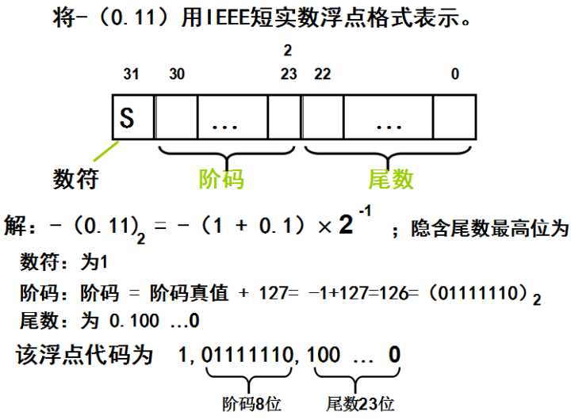

   

    在这里详细介绍下，也当作自己的总结: 首先介绍一些基本数据类型的数值范围以及注意事项：  <b>4字节有符号int值：</b>-2^31 至 2^31-1 （由于计算机采用补码标示，+0代表0 -0代表绝对值最大的负值）是21亿多的范围具体就是 -21 4748 3648 到 21 4748 3647 附带提一句: 在Java代码中调用System.out.println(System.currentTimeMillis()); 返回的数值现在是 14424 1484 5783 这是ms的标示值，一般情况下我们那显示都是精确到s，那么(int)(time/1000就可以了，注意，此时的值是14亿多，这样其实离int的最大值还有相当距离，如果我们默认自己的应用不会再30年之后使用，大可使用int，但是建议使用long。 插个有趣的事情，维基百科上关于Unix时间的条目 <h3>2038年问题</h3> 主条目：<a href="https://link.zhihu.com/?target=https%3A//zh.wikipedia.org/wiki/2038%25E5%25B9%25B4%25E5%2595%258F%25E9%25A1%258C" class=" wrap external" target="_blank" rel="nofollow noreferrer">2038年问题</a>  2038年1月19日3时14分07秒，32位系统的UNIX时间将会被重置。 
现时大部分使用UNIX的系统都是<a href="https://link.zhihu.com/?target=https%3A//zh.wikipedia.org/wiki/32%25E4%25BD%258D%25E5%2585%2583" class=" wrap external" target="_blank" rel="nofollow noreferrer">32位</a>的，即它们会以32位有符号整数表示时间类型time_t。因此它可以表示136年的秒数。表示协调世界时间1901年12月13星期五20时45分52秒至2038年1月19日3时14分07秒（二进制：01111111 11111111 11111111 11111111，0x7FFF:FFFF），在下一秒二进制数字会是10000000 00000000 00000000 00000000（0x8000:0000），这是负数，因此各系统会把时间误解作1901年12月13日20时45分52秒（亦有说回归到1970年）。这时可能会令软件发生问题，导致系统瘫痪。

目前的解决方案是把系统由32位转为<a href="https://link.zhihu.com/?target=https%3A//zh.wikipedia.org/wiki/64%25E4%25BD%258D%25E5%2585%2583" class=" wrap external" target="_blank" rel="nofollow noreferrer">64位</a>系统。在64位系统下，此时间最多可以表示到292,277,026,596年12月4日15时30分08秒。
<h3>Unix负时间导致部分iPhone手机无法启动</h3>
在2016年2月12日，据披露，如果把苹果<a href="https://link.zhihu.com/?target=https%3A//zh.wikipedia.org/wiki/IPhone" class=" wrap external" target="_blank" rel="nofollow noreferrer">iPhone</a>、<a href="https://link.zhihu.com/?target=https%3A//zh.wikipedia.org/wiki/IPad" class=" wrap external" target="_blank" rel="nofollow noreferrer">iPad</a>等设备的系统时间设置为1970年1月1日，随后重启设备，它会直接变砖。目前苹果公司正式承认了漏洞存在，但是尚未公布具体的引发原因。

     <blockquote>
      <a href="https://link.zhihu.com/?target=https%3A//zh.wikipedia.org/wiki/UNIX%25E6%2597%25B6%25E9%2597%25B4%23cite_note-2" class=" wrap external" target="_blank" rel="nofollow noreferrer">[2]</a>
     </blockquote>部分中国大陆用户猜想这是因为调整当地时间到1970.1.1 0:00后，如果时区为正，那么GMT时间就早于unix定义的0时间。例如北京时间 1970.1.1 0:00 (UTC+0800) 是UTC 1969.12.31 16:00 对应的unix时间是负的。但是有人回应尝试设为正时区重启后仍然变砖。
     <blockquote>
      <a href="https://link.zhihu.com/?target=https%3A//zh.wikipedia.org/wiki/UNIX%25E6%2597%25B6%25E9%2597%25B4%23cite_note-3" class=" wrap external" target="_blank" rel="nofollow noreferrer">[3]</a>
     </blockquote>苹果对此采用的策略是在随后的固件更新中将时间禁止调整到2000年以前。<b>2字节short值: -</b>2^15 到 2^15-1 这也恰巧和计算机端口号的范围类似 0-65535（ 系统保留端口(从0到1023) 动态端口(从1024到65535) ）  <b>1字节byte值:</b>-2^7 到 2^7-1   那么4字节的浮点数的范围怎么进行计算？为什么4字节的浮点数可以表示那么大的数据？ 下图是4字节浮点数在计算机的表示说明：  
     <figure>
      
     </figure>关于阶码： 在机器中表示一个浮点数时需要给出指数，这个指数用整数形式表示，这个整数叫做阶码，阶码指明了小数点在数据中的位置。 对于任意一个二进制数N，可用N=S&times;2^P表示，其中S为尾数，P为阶码，2为阶码的底，P、S都用二进制数表示，S表示N的全部有效数字，P指明小数点的位置。当阶码为固定值时，数的这种表示法称为定点表示，这样的数称为“定点数”；当阶码为可变时，数的这种表示法称为浮点表示，这样的数称为“浮点数”。  为什么要定义使用阶码? 因为浮点数的定义导致的，也是浮点数的表示需求产生的。 浮点数是属于有理数中某特定子集的数的数字表示，在计算机中用以近似表示任意某个实数。具体的说，这个实数由一个整数或定点数（即尾数）乘以某个基数（计算机中通常是2）的整数次幂得到，这种表示方法类似于基数为10的科学记数法。    <b>问题一：为什么32位浮点数阶码要有偏移量？</b> <b> 原因还是为了计算机处理数据的方便，还记得为什么计算机要有补码吗？原因就是希望在加法运算中将减法运算一并处理了，简化CPU中运算器的设计，确实我们通过补码实现了加减法的统一。</b> <b> 现在我们将浮点数用这种形式保存，那么计算机怎么比较浮点数的大小呢？</b> <b> 浮点数表示有两个符号位置，一个是数符S，一个是阶码的符号，如果仅仅采用补码作为阶码，</b><b>由</b><b>于阶码有正有负，整个数的符号位和阶数的符号位将导致不能进行简单的大小比较，所以阶数采用了一个无符号的正整数存储。阶数的值直接进行二进制计算，符号位置是默认为0的，于是阶数的值可以为0 到 255 </b>   <b>问题二：为什么偏移量设置为127？</b> 
<b>当阶码<i>E </i>为全0且尾数<i>M </i>也为全0时，表示的真值<i>x </i>为零，结合符号位<i>S </i>为0或1，有正零和负</b>

<b>零之分。当阶码<i>E </i>为全1且尾数<i>M </i>为全0时，表示的真值<i>x </i>为无穷大，结合符号位<i>S </i>为0或1，也有</b>

<b>+∞和-∞之分。这样在32位浮点数表示中，要除去<i>E </i>用全0和全1(255)10表示零和无穷大的特殊</b>

<b>情况，指数的偏移值不选128(10000000)，而选127(01111111)。对于规格化浮点数，<i>E </i>的范围变</b>

<b>为1到254，真正的指数值<i>e </i>则为-126到+127。因此32位浮点数表示的绝对值的范围是10-38~10^38</b>

<b>（以10的幂表示）。</b>
 
      
       
    
    
这样我们就知道了，其实我们的浮点数是这样表示在计算机当当中的，那么浮点数的范围呢？ float与double的范围和精度  1. 范围  float和double的范围是由指数的位数来决定的。  float的指数位有8位，而double的指数位有11位，分布如下：  float：  1bit（符号位） 8bits（指数位） 23bits（尾数位）  double：  1bit（符号位） 11bits（指数位） 52bits（尾数位）  于是，float的指数范围为-126~+127，而double的指数范围为-1022~+1023，并且指数位是按补码的形式来划分的。 之所以是上面的范围：上面黑体字部分已经解释了，为了比较方便，我们将指数加偏移量改为正值，由于隐匿一位偏移导致偏移量整体-1   其中负指数决定了浮点数所能表达的绝对值最小的非零数；而正指数决定了浮点数所能表达的绝对值最大的数，也即决定了浮点数的取值范围。  float的范围为-2^127 ~ +2^127，也即-3.40E+38 ~ +3.40E+38；double的范围为-2^1023 ~ +2^1023，也即-1.79E+308 ~ +1.79E+308。 2. 精度  float和double的精度是由尾数的位数来决定的。浮点数在内存中是按科学计数法来存储的，其整数部分始终是一个隐含着的“1”，由于它是不变的，故不能对精度造成影响。  float：2^23 = 8388608，一共七位，这意味着最多能有7位有效数字，但绝对能保证的为6位，也即float的精度为6~7位有效数字；  double：2^52 = 4503599627370496，一共16位，同理，double的精度为15~16位。  这样IEE754就算基本弄清了吧 参考这个资料可以获得更详细的解释 
     <figure>
      
     </figure> 
计算机中常用的数据表示格式有两种，一是定点格式，二是浮点格式。一般来说，定点格式容

许的数值范围有限，但要求的处理硬件比较简单。而浮点格式容许的数值范围很大，但要求的处

理硬件比较复杂。

     <figure>
      
     </figure> 
<b>定点表示</b>：约定机器中所有数据的小数点位置是固定不变的。由于约定在固定的位置，小数

点就不再使用记号“.”来表示。通常将数据表示成<b>纯小数</b>或<b>纯整数</b>。

　　定点数<i>ｘ＝ｘ</i><i>0</i><i>ｘ</i><i>1</i><i>ｘ</i><i>2</i><i>…ｘ</i><i>n </i>在定点机中表示如下(<i>ｘ</i><i>0</i>:符号位，0代表正号，1代表负号):

     <figure>
      
     </figure><b>纯小数</b>的表示范围为(<i>ｘ</i><i>0</i><i>ｘ</i><i>1</i><i>ｘ</i><i>2</i><i>…ｘ</i><i>n </i>各位均为0时最小；各位均为1时最大) 

     <figure>
      
     </figure><b>纯整数</b>的表示范围为 

     <figure
      
     </figure>目前计算机中多采用定点纯整数表示，因此将定点数表示的运算简称为<b>整数运算</b>。 

     <figure>
      
     </figure>
电子的质量(9&times;10－28克)和太阳的质量(2&times;1033克)相差甚远，在定点计算机中无法直接来表

示这个数值范围.要使它们送入定点计算机进行某种运算，必须对它们分别取不同的比例因子，

使其数值部分绝对值小于1，即：

     <figure>
      
     </figure>
这里的比例因子10－27和 1034要分别存放在机器的某个存储单元中，以便以后对计算结果

按这个比例增大。显然这要占用一定的存储空间和运算时间。因此得到浮点表示法如下：

<b>　　浮点表示法</b>：把一个数的有效数字和数的范围在计算机的一个存储单元中分别予以表示，

这种把数的范围和精度分别表示的方法，数的小数点位置随比例因子的不同而在一定范围内自

由浮动。 

　　任意一个十进制数 <i>Ｎ</i> 可以写成

     <figure>
      
     </figure>
     <figure>
      
     </figure>
     <figure>
      
     </figure>
     <figure>
      
     </figure>
为提高数据的表示精度，当尾数的值不为 0 时，尾数域的最高有效位应为1,否则以修改

阶码同时左右移小数点的办法，使其变成这一表示形式，这称为浮点数的<b>规格化表示</b>。 

　　当浮点数的尾数为 0，不论其阶码为何值，或者当阶码的值遇到比它能表示的最小值还小

时，不管其尾数为何值，计算机都把该浮点数看成零值，称为<b>机器零</b>。 

　　当阶码<i>E </i>为全0且尾数<i>M </i>也为全0时，表示的真值<i>x </i>为零，结合符号位<i>S </i>为0或1，有正零和负

零之分。当阶码<i>E </i>为全1且尾数<i>M </i>为全0时，表示的真值<i>x </i>为无穷大，结合符号位<i>S </i>为0或1，也有

+∞和-∞之分。这样在32位浮点数表示中，要除去<i>E </i>用全0和全1(255)10表示零和无穷大的特殊

情况，指数的偏移值不选128(10000000)，而选127(01111111)。对于规格化浮点数，<i>E </i>的范围变

为1到254，真正的指数值<i>e </i>则为-126到+127。因此32位浮点数表示的绝对值的范围是10-38~1038

（以10的幂表示）。

<i>浮点数所表示的范围远比定点数大。一台计算机中究竟采用定点表示还是浮点表示,</i>

<i>要根据计算机的使用条件来确定。一般在高档微机以上的计算机中同时采用定点、浮点</i>

<i>表示,由使用者进行选择,而单片机中多采用定点表示。 </i>

     <figure>
      
     </figure>
     <figure>
      
     </figure>
    <!-- react-empty: 221 -->
   

   

   

  

